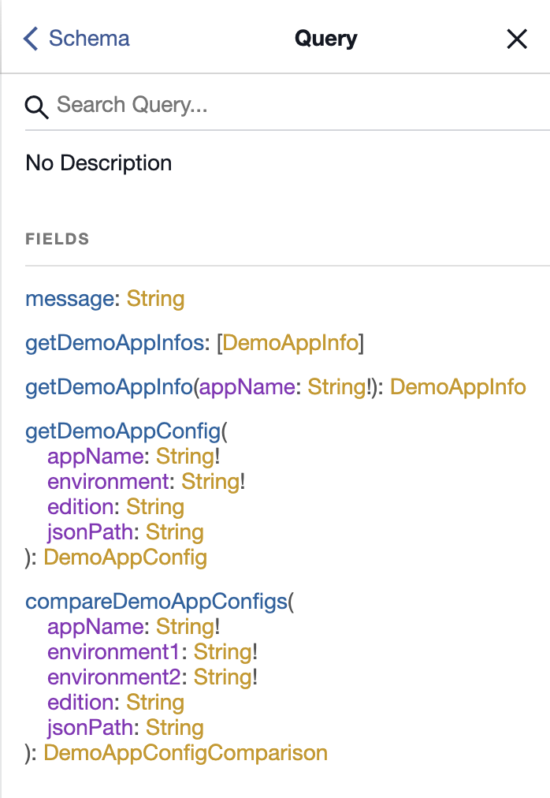

# Code for Sept 2018 Graphql lunch and learn

## Running locally

### Run the "whole" app (the finished product after all of the steps)

1. ```git clone *****************..git```
2. ```cd graphql-lunch-n-learn-sept-2018-demo```
3. ```yarn install```
4. ```yarn start```
5. open ```http://localhost:4000/graphiql```
6. write and run some queries

## Running steps locally

Same as above except 4. ```yarn step1``` to run step 1 and so on.

Here's what the final automatically-generated GraphQl Query definitions look like:




_Cheers_